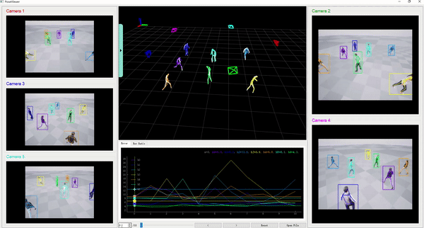

# PoseViewer

A python GUI for visualizing 3D human poses and facilitating debugging of pose related tasks.



## Install

---

Requirements:

* python >= 3.8
* numpy
* [pyqtgraph](https://github.com/pyqtgraph/pyqtgraph)
  * PyQt5
  * pyopengl
  * cupy (optional)
* pyav
* pims

```shell
pip install -r requirements.txt
```

## Features

---

* Support multi-human and multi-camera.
* Written in python, easy to use and hack.
* Based on Qt, easy to add various interactive widgets.

## Quickstart

---

1. Save your 3d pose data as a numpy data file ```.npz```.
2. Save 2D images captured from different views as seperate video files ```.mp4```.
3. Open them with the visualizer.

```python
python -m visualize  # open the example data under /examples/seq1
```

## Feed Your Own Data

---

<details>

<summary>3D data (.npz file)</summary>

* `gt3d`: GT 3d human pose sequence. Numpy array of shape `[t, max_Ngt, j, 3]`. `t`: frame id. `max_Ngt`: max number of gt humans across the whole sequence. Fill zeros for missing humans and joints. `[j, 3]`: 3D location of j joints.

* `pred3d`: Predicted 3d human pose sequence. Numpy array of shape `[t, max_Npred, j, 3]`. max_Npred: max number of pred humans. Fill zeros for missing humans and joints.

* `camera (optional)`: camera location sequence. Numpy array of shape `[t, max_c, 5, 3]`. `max_c`: max number of cameras in a frame. More detailes can be found [here](docs/Camera.md).

* `map_center (optional)`: center of map, used to offset the ground plane. Default to `[0, 0, 0]`.

</details>

<details>

<summary>2D view (optional)</summary>

* Video files, `.mp4, .mov, .avi`, the same length as 3D data.

</details>

## Citation

---

This visualizer is developed under project [Active3DPose](https://sites.google.com/view/active3dpose/home). If you find it helpful, please consider citing:

```bibtex
@inproceedings{ciproactive,
  title={Proactive Multi-Camera Collaboration for 3D Human Pose Estimation},
  author={Ci, Hai and Liu, Mickel and Pan, Xuehai and Zhong, Fangwei and Wang, Yizhou},
  booktitle={International Conference on Learning Representations}
}
```

## License

---

Apache License, Version 2.0.
