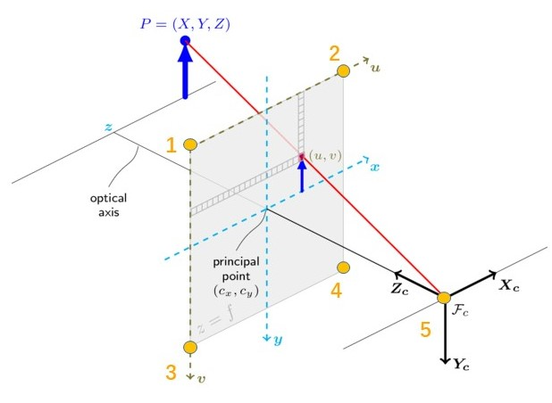

# Camera Data

5 points to plot the camera. The following figure are borrowed and modified from [opencv](https://docs.opencv.org/2.4/modules/calib3d/doc/camera_calibration_and_3d_reconstruction.html).



```python
# Example, how to get the required 5 points.
import numpy as np
resolution = [720, 640]
camera_data = np.array([
    [-resolution[0] / 2, -resolution[1] / 2, CamModel.focal],  # focal length
    [resolution[0] / 2, -resolution[1] / 2, CamModel.focal],
    [-resolution[0] / 2, resolution[1] / 2, CamModel.focal],
    [resolution[0] / 2, resolution[1] / 2, CamModel.focal],
    [0, 0, 0]
])  # points in camera frame
camera_data = CamModel.cam_to_world(camera_data)  # [5, 3] in world frame
```
